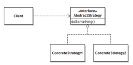
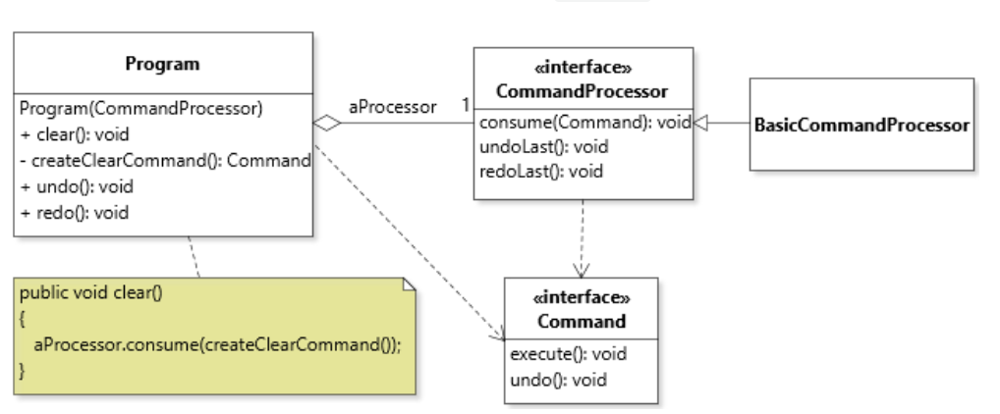

# Design Patterns
## Iterator Design Pattern
- Provide a way to access the elements of an aggregate object sequentially without exposing its underlying representation


---

## Strategy Design Pattern
- polymorphism
- Define a family of algorithms, encapsulate each one, and make them interchangeable. Strategy lets the algorithms vary independently from clients that use it.



---

## Interface Segregation Principle
> client code should not be forced to depend on interfaces it does not need

---

## Liskov Substitution Principle (LSP)

> what we can do with a higher type, we can do it with a lower type.

If `S` is a subtype of `T`, then objects of type `T` may be replaced with objects of type `S`.

---

## Factory Method Design Pattern
> primary role is to return an object
```java
public static Comparator<Hand> createAscendingComparator(){
	return new Comparator<Hand>() {
		@Override
		public int compare(Hand pHand1, Hand pHand2) {
			return pHand1.aCards.size() - pHand2.aCards.size();
		}
	};
}
```

---

## Flyweight Design Pattern

The FLYWEIGHT pattern provides a way to cleanly manage collections of low-level immutable objects. Although often used to address performance concerns, FLYWEIGHT is also valuable to **ensure the uniqueness of objects of a class**. 
- flyweight objects should be **immutable** to ensure that their uniqueness can be preserved
- two types of flyweights
  - pre-initialize the flyweight store
  - lazily created flyweight store

> 1. A `private` ***constructor*** for the flyweight class, so clients cannot control the creation of objects of the class; 
> 2. A `static` ***flyweight store*** that keeps a collection of flyweight instances;
> 3. A `static` ***access method*** that returns the unique flyweight object that corresponds to some identification key. The access method typically checks if the requested flyweight object already exists in the store, creates it if it does not already exist, and returns the unique object. 

### Example of pre-initialized flyweight store
```java
public class Card {
	// Flyweight store
	private static final Card[][] CARDS = new Card[Suit.values().length][Rank.values().length];
	
	private final Rank aRank;
	private final Suit aSuit;
	
	// Initialization of the flyweight store
	static {
		for( Suit suit : Suit.values() )
		{
			for( Rank rank : Rank.values() )
			{
				CARDS[suit.ordinal()][rank.ordinal()] = new Card(rank, suit);
			}
		}
	}
	
	// Private constructor
	private Card( Rank pRank, Suit pSuit) {
		aRank = pRank;
		aSuit = pSuit;
	}

	public static Card get(Rank pRank, Suit pSuit) {
		assert pRank != null && pSuit != null;
		return CARDS[pSuit.ordinal()][pRank.ordinal()];
	}
```

### Example of lazily created flyweight store
```java
public class Card {
	// Flyweight store
	private static final Card10[][] CARDS = new Card10[Suit.values().length][Rank.values().length];
	
	private final Rank aRank;
	private final Suit aSuit;
	
	// Private constructor
	private Card( Rank pRank, Suit pSuit) {
		aRank = pRank;
		aSuit = pSuit;
	}
	
	public static Card get(Rank pRank, Suit pSuit) {
		assert pRank != null && pSuit != null;
		Card card = CARDS[pSuit.ordinal()][pRank.ordinal()];
		if( card == null ) {
			card = new Card(pRank, pSuit);
			CARDS[pSuit.ordinal()][pRank.ordinal()] = card;
		}
		return card;
	}
}
```

> Comment: the flyweight store could also be a `Map<T, K>`
> - unique instance to the class

---

## Singleton 
The SINGLETON design pattern provides a principled way to ensure that there is **only one instance of a given class at any point in the execution of the code**. 
- stateful and mutable
> 1. A `private` constructor for the singleton class, so clients cannot create duplicate objects; 
> 2. A `global` variable for holding a reference to the single instance of the singleton object. 
> 3. An `static accessor` method, usually called `instance()`, that returns the singleton instance. 

```java
public class GameModel {
	private static final GameModel INSTANCE = new GameModel();
	private final Deck aDeck = new Deck();
	
	public static GameModel instance() {
		return INSTANCE;
	}

    // Private constructor
	private GameModel() {}
	
	public void newGame() {
		aDeck.shuffle();
	}
}

GameModel.instance();
```

> Comment: single instance to the class
---

## Composite Design Pattern
```java
public class CompositeShow implements Show
{
	private List<Show> aShows = new ArrayList<>();
	
	public CompositeShow(Show...pShows)
	{
		if( pShows.length < 2 || pShows.length > 5)
		{
			throw new IllegalArgumentException("Arguments should be between two and five shows inclusively");
		}
		aShows.addAll(Arrays.asList(pShows));
	}
	
	@Override
	public String description()
	{
		StringJoiner description = new StringJoiner("; ", "[", "]");
		for( Show show : aShows )
		{
			description.add(show.description());
		}
		return description.toString();
	}

	@Override
	public int runningTime()
	{
		int time = 0;
		for( Show show : aShows )
		{
			time += show.runningTime();
		}
		return time;
	}
}
```

---

## Decorator Design Pattern
```java
public class IntroducedShow implements Show {
	private final Show aShow;
	private final String aSpeaker;
	private final int aSpeechTime;
	
	public IntroducedShow(String pName, int pTime, Show pShow ) {
		aShow = pShow;
		aSpeaker = pName;
		aSpeechTime = pTime;
	}
	
	@Override
	public String description() { 
        return "[" + aSpeaker + " introduces " + aShow.description() + "]";
    }

	@Override
	public int runningTime() { 
        return aSpeechTime + aShow.runningTime();
    }
}
```


---

## Prototype Design Pattern
- Clonable in java
> 1. Declaring to implement the `Cloneable` interface; 
> 2. Overriding the `Object.clone()` method; 
> 3. Calling `super.clone()` in the `clone()` method; 
> 4. Catching `CloneNotSupportedException` in the `clone()` method; 
> 5. Optionally, declaring the clone() method in the root supertype of a cloneable hierarchy.
```java
public class CompositeCardSource implements Cloneable {
    private List<CardSource> aElements;

    @Override
	public CardSource clone() {
		try {
			CompositeCardSource clone = (CompositeCardSource) super.clone();
			clone.aElements = new ArrayList<>();
			for(CardSource source : aElements) {
				clone.aElements.add(source.clone());
			}
			return clone;
		} catch (CloneNotSupportedException e) {
			return null;
		}
	}
}
```
---
## Command Design Pattern
```java
public interface Command{
    void execute();
    void undo();
}
```

```java
public class Program{
    private final EnumMap<Day, Show> aShows = new EnumMap<>(Day.class);

    public Program() { 
        clear();
    }
        
    public void clear() {
        for( Day day : Day.values() ) {
            aShows.put(day, NULL);
        }
    }

    public void remove(Day pDay) {
        assert pDay != null;
        aShows.remove(pDay);
    }

    public void add(Day pDay, Show pShow) {
        assert pShow != null && pDay != null;
        aShows.put(pDay, pShow);
    }

    public Command createAddCommand(Show pShow, Day pDay) {
        return new Command() {
            @Override
            public void execute() {
                add(pDay, pShow);
            }

            @Override
            public void undo() {
                remove(pDay);
            }
        };
    }

    public Command createRemoveCommand(Day pDay) {
        return new Command() {
            private Optional<Show> aRemoved = Optional.empty();

            @Override
            public void execute() {
                Show show = get(pDay);
                aRemoved = Optional.of(show);
                remove(pDay);
            }

            @Override
            public void undo() {
                assert aRemoved.isPresent();
                add(aRemoved.get(), pDay);
            }
        };
    }
}
```

```java
public class CommandProcessor {
   private final List<Command> aExecutedCommands = new ArrayList<>();
   private final List<Command> aUndoneCommands = new ArrayList<>();

   public void consume(Command pCommand) {
      pCommand.execute();
      aExecutedCommands.add(pCommand);
   }
 
   public void undoLast() {
      assert !aExecutedCommands.isEmpty();
      Command command = aExecutedCommands.remove(aExecutedCommands.size()-1);
      command.undo();
      aUndoneCommands.add(command);
   }
	
   public void redoLast() {
      assert !aUndoneCommands.isEmpty();
      Command command = aUndoneCommands.remove(aUndoneCommands.size()-1);
      consume(command);
      aExecutedCommands.add(command);
   }
}
```

```java
public class Client{
    public static void main(String[] args) {
        Program program = new Program();

        Command c1 = program.createAddCommand(SHOW1, DAY1);
        Command c2 = program.createAddCommand(SHOW2, DAY2);
        Command c3 = program.createRemoveCommand(DAY1);

        CommandProcessor processor = new CommandProcessor();
        processor.consume(c1);
        processor.consume(c2);
        processor.consume(c3);
        processor.undoLast();
    }
}
```


